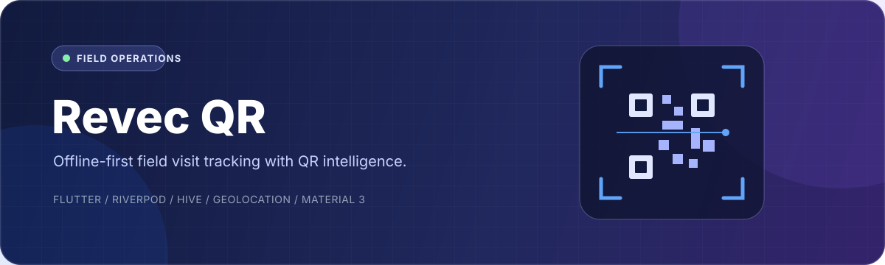
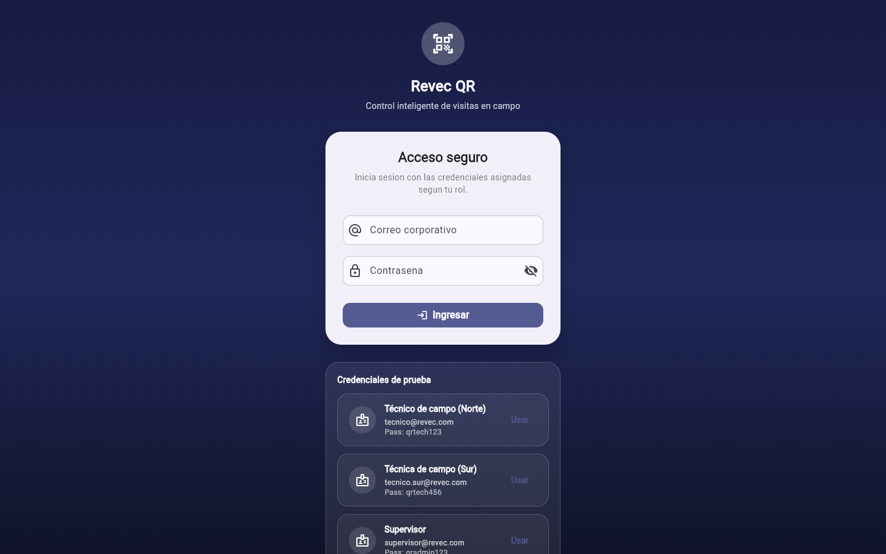
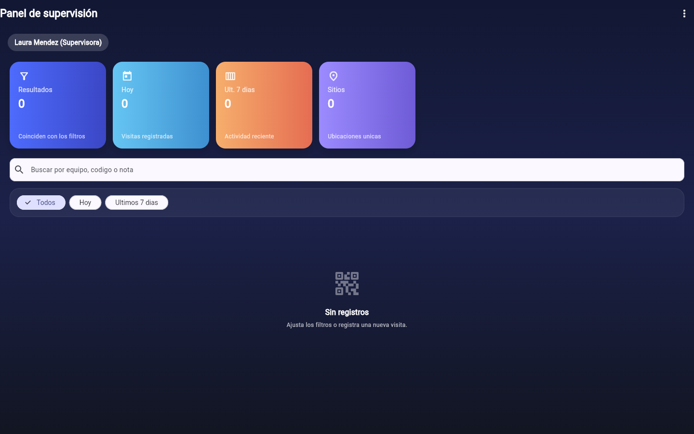
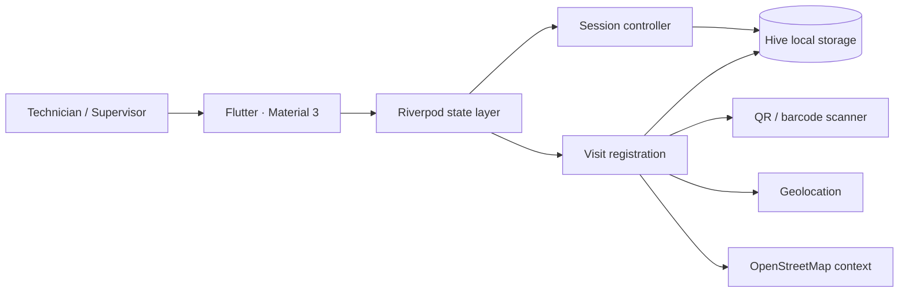

<div align="center">
  
</div>

<br />

<div align="center">
  <a href="https://github.com/ZedritG/Revac_Qr/actions/workflows/flutter-ci.yml">
    
  </a>
  
  
  
</div>

## Overview

**Revec QR** is a Flutter application for field technicians and supervisors
who need to register equipment visits reliably through QR or barcode scanning.
It combines role-aware workflows, local persistence, geolocation, and visit
history in a focused Material 3 experience.

The project is designed as a realistic operational prototype: it works offline,
restores sessions locally, captures field context, and gives supervisors a
searchable view of activity.

## Product preview

<table>
  <tr>
    <td width="50%" align="center">
      
    </td>
    <td width="50%" align="center">
      
    </td>
  </tr>
  <tr>
    <td align="center"><sub>Role-aware secure access</sub></td>
    <td align="center"><sub>Supervisor history and filters</sub></td>
  </tr>
</table>

## What the product covers

| Capability | Product value |
| --- | --- |
| **QR and barcode scanning** | Reduces manual entry during field visits |
| **Offline-first persistence** | Keeps the workflow usable without reliable connectivity |
| **Role-aware sessions** | Gives technicians and supervisors the right level of access |
| **Location capture** | Adds geographic context to every validated visit |
| **Visit history** | Supports search, time filters, technician filters, and detailed records |
| **Map context** | Displays validated coordinates with OpenStreetMap |

## Architecture



The codebase follows feature-oriented boundaries:

```text
lib/
├── bootstrap/            # App initialization
├── core/                 # Routing, logging and shared infrastructure
└── features/
    ├── auth/             # Session data, domain and presentation
    └── visits/           # Visit data, domain and presentation
```

### Technical decisions

- **Riverpod** keeps dependencies and asynchronous state explicit.
- **Hive** supports fast local persistence and session restoration.
- **Feature layers** separate data, domain, and presentation concerns.
- **Centralized logging** records relevant warnings and controller failures.
- **Material 3** provides a responsive and consistent visual foundation.

## Run locally

### Requirements

- Flutter 3.24 or newer
- Dart SDK compatible with `^3.8.1`
- A device or emulator with camera support for the complete scan flow
- Location permissions enabled for coordinate capture

### Setup

```bash
flutter pub get
flutter run
```

For web preview:

```bash
flutter run -d chrome
```

> Camera and geolocation capabilities depend on browser and device permissions.

<details>
<summary><strong>Local demo access</strong></summary>

These credentials are local mock data intended only for the demo:

| Role | Email | Password |
| --- | --- | --- |
| Technician — North | `tecnico@revec.com` | `qrtech123` |
| Technician — South | `tecnico.sur@revec.com` | `qrtech456` |
| Supervisor | `supervisor@revec.com` | `qradmin123` |

Test QR images are available in [`docs/qr-codes/`](./docs/qr-codes/).

</details>

## Quality checks

```bash
flutter analyze
flutter test
flutter build web --release
```

The current test suite covers session behavior and visit registration logic.
GitHub Actions repeats analysis, tests, and a web build for every pull request.

## Current limitations

- Local/mock authentication instead of a production identity provider
- Local-only visit storage without remote synchronization
- No attachment or multi-photo workflow yet
- Spanish-only product copy
- Dark mode and accessibility can be expanded further

## Roadmap

- Remote synchronization and conflict resolution
- Export and backup workflows
- Multiple photo attachments per visit
- Internationalization
- Production authentication and audit trail

---

Built by [Ronald Rodríguez](https://github.com/ZedritG) as a product engineering
case study covering field UX, offline data, mobile architecture, and validation.
